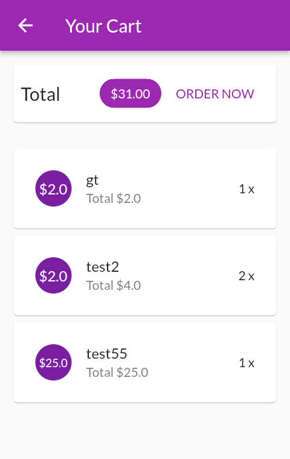
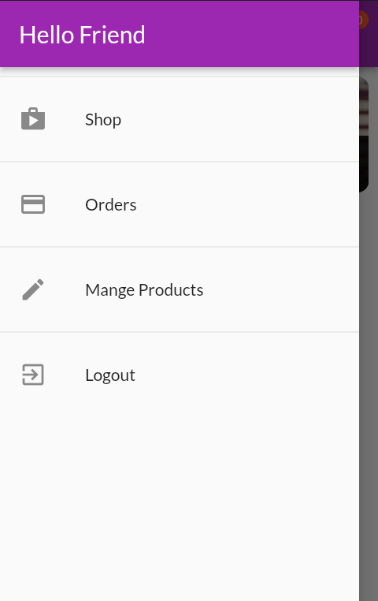
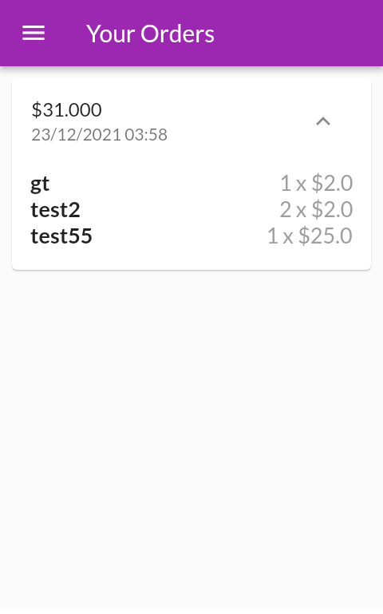
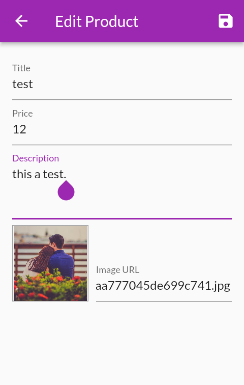

# Shop Flutter App

### Flutter Shop App Using Providers StateManagement, Firebase.
### Http Requests & POST Requests , PATCH Requests.
### Managing the Auth Token Locally and using ProxyProvider.
### Custom Exceptions , Handling Errors & async , await.
### Pull-to-Refresh , Updating Data & FutureBuilder
### Providers State Management and Multiple Providers.
### Cart Functionality Using Provider
### Adding Orders , Side Drawer
### Snackbars & Undoing Add to Cart Actions.
### Showing Alert Dialogs & Edit Product , Delete Products.
### Cart Functionality.
### Using the AnimatedBuilder & Hero Transition.

#### Packages:
- provider
- intl
- http
- shared_preferences

# Screenshot's 

